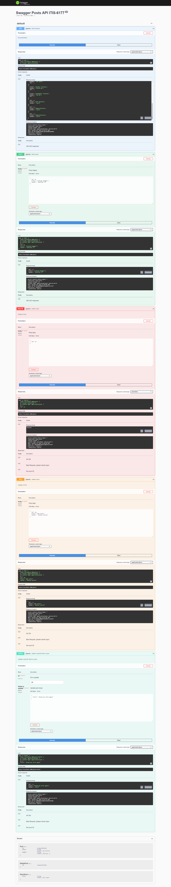

# swaggerdoc-ITIS-6177

- Used JSON SERVER as a Database and created swagger documentation.

# Run instructions
- Run the database (json-server --watch db.json)
- Run the server.js (node server.js)

- Access the swagger docs at http://localhost:3001/docs

